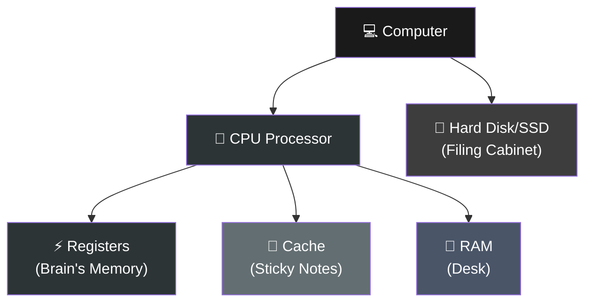

# 🎯 Introduction to Go (Golang)

## What is Go?

### Definition

Go (also called Golang) is a **programming language created by Google in 2007**.

Think of it like this:
- **Programming Language** = A way to give instructions to computers
- **Go** = Google's modern way of doing it (simple + fast + efficient)

It's designed for **real-world problems** like building servers, APIs, and tools.

---

## Key Features of Go

Go has some special abilities that make it different:

1. **Compiled** - Your code becomes machine code (executes very fast)
2. **Statically Typed** - Variables have fixed types (safer code)
3. **Fast Compilation** - Code compiles in seconds
4. **Built-in Concurrency** - Handle many tasks at once easily
5. **Simple Syntax** - Only 25 keywords (very easy to learn)
6. **Cross-platform** - Works on Windows, Mac, Linux

---

## How Go Compilation Works?

When you write Go code, it must be converted to machine code (binary) that your computer can run.

**Steps:**
1. Write code in VSCode → `hello.go`
2. Run command → `go build hello.go`
3. Go compiler translates code to machine code
4. Creates executable → `hello.exe` or `hello`
5. Run the executable → Program runs instantly

**Important:** Compilation is manual. You must run `go build` command.

---

## What are Registers?

Registers are small, super-fast memory locations inside the CPU (processor).

**Think of your computer like a house:**



When Go compiles your code, it stores frequently-used data in registers. This makes execution very fast.

---

## How Registers Work in Background?

When you run a Go program, CPU needs to access data to process it.

**Process:**

1. **CPU needs data** (like x = 10)
2. **Checks Registers first** - "Is x stored in registers?"
3. **If YES** → Gets data instantly ⚡ (1 nanosecond)
4. **If NO** → Checks Cache (10 nanoseconds)
5. **If NOT in Cache** → Checks RAM (100 nanoseconds)
6. **If NOT in RAM** → Checks Hard Disk (millions of nanoseconds) 🐌

**Why Go is Fast:**
Go compiler puts frequently-used data in registers, so CPU finds it instantly without waiting.

**Example:**
```go
x := 10
y := 20
sum := x + y
```

Go compiler thinks: "x and y are used immediately, store in registers"
- CPU gets x from register → 1 nanosecond
- CPU gets y from register → 1 nanosecond
- CPU adds them → 1 nanosecond
- Total: 3 nanoseconds ⚡

---

## Comparison with Other Languages

**Go vs Python:**
- Go compiles once before running (fast)
- Python translates while running (slow)

**Go vs Java:**
- Go creates machine code directly
- Java creates bytecode, then needs JVM to translate (extra step, slower)

**Go's Speed Advantage:**
- Compiled code runs directly on CPU
- Data stored in registers (fastest memory)
- No extra translator running
- No overhead

---

## 💡 Key Takeaways

1. Go = Simple + Fast + Efficient language for servers and tools
2. You must compile code before running (not automatic)
3. Go is faster than Python and Java
4. Registers are fastest memory inside CPU
5. Compilation converts your code to machine code that CPU understands

---