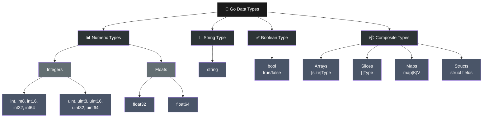

# 📊 Data Types in Go

## What is a Data Type?

A data type tells Go **what kind of value** a variable will store.

Go has different categories of data types:
1. Numeric Types (integers, floats)
2. String Type (text)
3. Boolean Type (true/false)
4. Composite Types (collections, grouped data)

---

## Numeric Types

### Integer Types (Whole Numbers)

Go has several integer types:

| Type | Range | Use Case |
|------|-------|----------|
| **int8** | -128 to 127 | Very small numbers |
| **int16** | -32,768 to 32,767 | Small numbers |
| **int32** | -2 billion to 2 billion | Regular numbers |
| **int64** | -9 quintillion to 9 quintillion | Very large numbers |
| **int** | Depends on system | Default choice |
| **uint8** | 0 to 255 | Only positive numbers |
| **uint16** | 0 to 65,535 | Only positive numbers |
| **uint** | 0 to positive only | Only positive numbers |

**Most common:** Use `int` (Go decides the size automatically)

```go
package main

import "fmt"

func main() {
    var num1 int8 = 100
    var num2 int16 = 32000
    var num3 int32 = 2000000000
    var num4 int64 = 9000000000000000000
    num5 := 42  // Default int type

    fmt.Println(num1)  // Output: 100
    fmt.Println(num2)  // Output: 32000
    fmt.Println(num3)  // Output: 2000000000
    fmt.Println(num4)  // Output: 9000000000000000000
    fmt.Println(num5)  // Output: 42
}
```

---

### Floating Point Types (Decimal Numbers)

Go has two floating point types:

| Type | Precision | Use Case |
|------|-----------|----------|
| **float32** | ~7 decimal places | Less precision, smaller memory |
| **float64** | ~15 decimal places | More precision (default) |

**Most common:** Use `float64`

```go
package main

import "fmt"

func main() {
    var price float64 = 19.99
    var discount float32 = 5.5
    pi := 3.14159265359  // Default float64

    fmt.Println(price)     // Output: 19.99
    fmt.Println(discount)  // Output: 5.5
    fmt.Println(pi)        // Output: 3.14159265359
}
```

---

## String Type (Text)

Strings store text and characters.

```go
package main

import "fmt"

func main() {
    name := "Alice"
    message := "Hello World"
    empty := ""  // Empty string
    multiline := "Go is\namazing"

    fmt.Println(name)       // Output: Alice
    fmt.Println(message)    // Output: Hello World
    fmt.Println(empty)      // Output: (nothing)
    fmt.Println(multiline)  // Output: Go is
                            //         amazing
}
```

**Important:** Strings are **immutable** (cannot change after creation).

---

## Boolean Type (True/False)

Boolean has only two values: `true` or `false`.

```go
package main

import "fmt"

func main() {
    isActive := true
    hasError := false
    isValid := 5 > 3  // Comparison results in bool

    fmt.Println(isActive)  // Output: true
    fmt.Println(hasError)  // Output: false
    fmt.Println(isValid)   // Output: true
}
```

---

## Type Conversion

Converting one type to another.

**Syntax:** `newType(value)`

```go
package main

import "fmt"

func main() {
    // int to float64
    age := 25
    ageFloat := float64(age)
    fmt.Println(ageFloat)  // Output: 25

    // float64 to int (loses decimal part)
    price := 19.99
    priceInt := int(price)
    fmt.Println(priceInt)  // Output: 19

    // int to int8
    num := 100
    smallNum := int8(num)
    fmt.Println(smallNum)  // Output: 100

    // Adding different types (must convert first)
    x := 10
    y := 3.14
    z := float64(x) + y
    fmt.Println(z)  // Output: 13.14
}
```

---

## Composite Types

Composite types are **collections of elements** or **multiple values grouped together**.

### Arrays (Fixed Size Collection)

An array stores multiple values of the **same type** with a **fixed size**.

```go
package main

import "fmt"

func main() {
    // Declare array with size
    var numbers [5]int
    numbers[0] = 10
    numbers[1] = 20
    fmt.Println(numbers)  // Output: [10 20 0 0 0]

    // Declare and initialize
    scores := [3]int{85, 90, 95}
    fmt.Println(scores)       // Output: [85 90 95]
    fmt.Println(scores[0])    // Output: 85
    fmt.Println(len(scores))  // Output: 3 (length)
}
```

**Key Points:**
- Fixed size (size is part of the type)
- All elements same type
- Access by index (0, 1, 2...)
- Cannot add more elements

---

### Slices (Dynamic Size Collection)

A slice is like an **array but with flexible size**.

```go
package main

import "fmt"

func main() {
    // Declare and initialize slice
    fruits := []string{"Apple", "Banana", "Orange"}
    fmt.Println(fruits)       // Output: [Apple Banana Orange]
    fmt.Println(fruits[0])    // Output: Apple
    fmt.Println(len(fruits))  // Output: 3

    // Add element with append
    fruits = append(fruits, "Mango")
    fmt.Println(fruits)        // Output: [Apple Banana Orange Mango]
    fmt.Println(len(fruits))   // Output: 4

    // Add multiple elements
    fruits = append(fruits, "Grapes", "Strawberry")
    fmt.Println(fruits)  // Output: [Apple Banana Orange Mango Grapes Strawberry]
}
```

**Key Points:**
- Dynamic size (grows/shrinks)
- All elements same type
- Access by index
- Can add elements with `append()`

---

### Maps (Key-Value Pairs)

A map stores **key-value pairs** (like a dictionary).

```go
package main

import "fmt"

func main() {
    // Declare and initialize map
    person := map[string]int{
        "Alice": 25,
        "Bob":   30,
        "Carol": 28,
    }

    fmt.Println(person)          // Output: map[Alice:25 Bob:30 Carol:28]
    fmt.Println(person["Alice"]) // Output: 25
    fmt.Println(person["Bob"])   // Output: 30

    // Add new key-value pair
    person["David"] = 32
    fmt.Println(person)  // Output: map[Alice:25 Bob:30 Carol:28 David:32]

    // Check if key exists
    age, exists := person["Eve"]
    fmt.Println(age, exists)  // Output: 0 false

    // Delete a key
    delete(person, "Carol")
    fmt.Println(person)  // Output: map[Alice:25 Bob:30 David:32]
}
```

**Key Points:**
- Store key-value pairs
- Keys and values have types
- Access by key (not index)
- Can add/remove pairs
- Fast lookup by key

---

### Structs (Custom Data Type)

A struct groups **different types** of data together.

```go
package main

import "fmt"

func main() {
    type Person struct {
        Name  string
        Age   int
        Email string
        City  string
    }

    person1 := Person{
        Name:  "Alice",
        Age:   25,
        Email: "alice@example.com",
        City:  "NewYork",
    }

    fmt.Println(person1)       // Output: {Alice 25 alice@example.com NewYork}
    fmt.Println(person1.Name)  // Output: Alice
    fmt.Println(person1.Age)   // Output: 25

    // Create another person
    person2 := Person{
        Name:  "Bob",
        Age:   30,
        Email: "bob@example.com",
        City:  "London",
    }

    fmt.Println(person2.Name)  // Output: Bob
    fmt.Println(person2.City)  // Output: London
}
```

**Key Points:**
- Group multiple fields
- Each field has a name and type
- Different types can be mixed
- Access by field name

---

## Comparison of Composite Types

| Type | Purpose | Fixed Size | Mixed Types |
|------|---------|-----------|-----------|
| **Array** | Fixed collection | ✅ Yes | ❌ No (same type) |
| **Slice** | Dynamic collection | ❌ No | ❌ No (same type) |
| **Map** | Key-value pairs | ❌ No | ✅ Yes (keys & values) |
| **Struct** | Group different data | ✅ Yes | ✅ Yes (different fields) |

---

## Constants

Values that **cannot be changed** after declaration.

```go
package main

import "fmt"

func main() {
    const pi = 3.14159
    const appName = "MyApp"
    const version = 1

    fmt.Println(pi)       // Output: 3.14159
    fmt.Println(appName)  // Output: MyApp
    fmt.Println(version)  // Output: 1

    // This will cause error:
    // pi = 3.14  // ERROR! Cannot change constant
}
```

**Use when:** Value should never change (like Pi, version number, configuration).

---

## Complete Data Types Summary




---

## 💡 Memory Points

1. **Numeric Types** = Numbers (int for whole, float64 for decimals)
2. **String Type** = Text (immutable)
3. **Boolean Type** = true or false
4. **Array** = Fixed size, same type elements
5. **Slice** = Dynamic size, same type elements, use `append()`
6. **Map** = Key-value pairs, fast lookup
7. **Struct** = Group different data types together
8. **Type Conversion** = `newType(value)` format
9. **Constants** = Values that cannot change after declaration
10. **Default Values** = 0 (int), 0.0 (float), "" (string), false (bool)

---